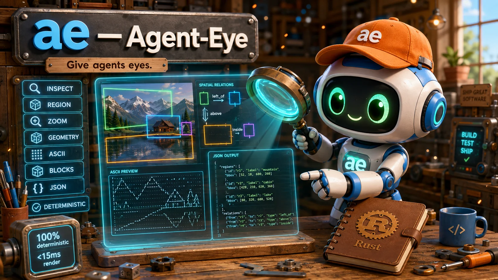

# ae — Agent-Eye

> [!WARNING]
> **🚧 MVP / Work in Progress** — `ae` is in MVP stage. The core pipeline
> (decode → region detection → spatial relations → render) is complete and
> fully tested, but features may change without notice. Not production-ready.
> Feedback and bug reports welcome!

**`ae` — Agent-Eye: give text-only AI agents eyes, without a vision model.**

`ae` is a Rust-native CLI that turns images (PNG/JPEG/WebP) into **deterministic
visual evidence**: detected regions with exact bounds, 7 formal spatial relations,
ASCII/blocks/braille renders — all with SHA-256 provenance mapping back to source
pixels. No LLM, no API keys, no cloud. The agent interprets; `ae` provides evidence.

**Why it exists:** text-only LLMs can't see images. The common workaround (stuffing
ASCII art into context) wastes tokens and loses spatial structure. `ae` solves this:
it compresses an image into structured evidence that lets an agent answer visual
questions with fewer tokens and more accuracy.

<div align="center">
  
</div>

<div align="center">

```text
                    IMAGE
                      │
                      ▼
               ┌─────────────┐
               │      ae     │
               │   Rust CLI  │
               └──────┬──────┘
                      │
            compact evidence
                      │
                      ▼
               TEXT-ONLY AGENT
```

---

## Quick Start

```bash
# Install (from source)
git clone https://github.com/quangdang46/agent_eye
cd agent_eye
cargo build --release
./target/release/ae --help
```

### Agent workflow — progressive inspection

```bash
# Step 1: overview
ae inspect screenshot.png --format json

# Step 2: agent decides to look at region r3
ae zoom screenshot.png --region r3 --format json

# Step 3: spatial evidence
ae geometry screenshot.png --format json

# Step 4: targeted crop
ae region screenshot.png r3 --format json
```

Agent drives the perception loop. `ae` provides primitives.

---

## The Problem

Text-only LLMs can't see images. When a coding agent encounters a screenshot, a UI mockup, or a diagram, it's blind. The common workaround — shoving raw ASCII into context — wastes tokens on flat regions while losing spatial structure.

**What's actually needed:**

- **Where** things are (geometry, not just luminance)
- **How regions relate** (left_of, above, inside — formal math, not guesses)
- **Progressive inspection** (overview → zoom into uncertain regions)
- **Provenance** (every representation maps back to original pixel coordinates)

## The Solution

`ae` is a **visual evidence layer** — not another ASCII converter.

```bash
ae inspect screenshot.png
# → 3 regions detected, spatial relations, geometry, ASCII overview

ae zoom screenshot.png --region r3
# → targeted crop + resample at 4x scale

ae geometry screenshot.png --format json
# → formal spatial relations with coordinate mapping
```

Every output includes **provenance**: source hash, original bounds, affine coordinate transform. Agent never loses connection to the source image.

---

## Why `ae`?

| Feature | ASCII-only tools | `ae` |
|---------|:----------------:|:----:|
| Grayscale rendering | ✅ | ✅ |
| Unicode blocks | ❌ | ✅ |
| Aspect correction | ⚠️ hardcoded | ✅ configurable |
| Region detection | ❌ | ✅ heuristic geometric |
| Spatial relations | ❌ | ✅ 7 formal relations |
| Coordinate mapping | ❌ | ✅ affine transform |
| Provenance tracking | ❌ | ✅ every output |
| Progressive inspection | ❌ | ✅ agent-driven |
| JSON output | ❌ | ✅ versioned schemas |
| Deterministic | ⚠️ varies | ✅ contract |
| No LLM required | ✅ | ✅ |

---

## Comparison

| Tool | Language | Regions | Relations | Provenance | JSON | Agent-native |
|------|----------|:-------:|:---------:|:----------:|:----:|:------------:|
| `ae` | Rust | ✅ | ✅ | ✅ | ✅ | ✅ |
| ASCII-generator | Python | ❌ | ❌ | ❌ | ❌ | ❌ |
| ascii-image-converter | Go | ❌ | ❌ | ❌ | ❌ | ❌ |
| pixel2ascii | Rust | ❌ | ❌ | ❌ | ❌ | ❌ |
| chafa | C | ❌ | ❌ | ❌ | ❌ | ❌ |

`ae` is not a replacement for these tools. It's a different category: **visual evidence for agents**, not terminal art for humans.

---

## Commands

```bash
ae <command> <image> [options]
```

| Command | Purpose | Example |
|---------|---------|---------|
| `inspect` | Orchestrated overview: regions, relations, render, mapping | `ae inspect photo.png --width 60` |
| `render` | ASCII/blocks rendering | `ae render photo.png --renderer ascii --width 100` |
| `geometry` | All detected regions + 7 formal spatial relations | `ae geometry photo.png --format json` |
| `region` | Extract area by `--box x,y,w,h` or `--region id`, with provenance | `ae region photo.png --box 24,16,32,16` |
| `zoom` | Crop + spatial-allocation resample (1×/2×/4×/8×) | `ae zoom photo.png --box 0,0,64,64 --level 2` |
| `capabilities` | Feature discovery for agents | `ae capabilities --format json` |

All commands accept `-` as the image path (piped binary stdin), support
`--format text|json`, and write versioned JSON schemas
(`agent-eye.scene.v1`, `agent-eye.render.v1`, `agent-eye.geometry.v1`,
`agent-eye.region.v1`, `agent-eye.zoom.v1`,
`agent-eye.capabilities.v1`). Every JSON output carries a SHA-256
`provenance.source_hash` of the original bytes plus the affine
`mapping` back to source pixels.

### render options

| Flag | Values | Default | Description |
|------|--------|---------|-------------|
| `--renderer` | `ascii`, `blocks` | `ascii` | Rendering engine |
| `--width` | `N` | `100` | Output width in characters |
| `--height` | `N` | derived | Output rows (else width ÷ aspect) |
| `--aspect` | float | `0.5` | Terminal-cell correction; `--aspect 1.0` = square |
| `--invert` | flag | off | Flip luminance→glyph mapping |
| `--charset` | preset or string | renderer default | `standard`, `dense`, `blocks`, `cyrillic`, `cjk`, `extended-ascii`, or custom ramp |
| `--grayscale` | flag | off | ANSI-256 grayscale presentation (human display) |
| `--full` | flag | off | Fit to terminal size (overrides `--width`) |
| `--format` | `text`, `json` | `text` | Output serialization |
| `--output` | `file` | stdout | Write to file (`--force` to overwrite) |

### region / zoom options

| Flag | Applies to | Description |
|------|------------|-------------|
| `--box x,y,w,h` | `region`, `zoom` | Source-pixel window (half-open) |
| `--region id` | `region` | Detected region id from `ae geometry` |
| `--level 0-3` | `zoom` | Spatial allocation scale: same output grid from a smaller window |

### capabilities output

```bash
$ ae capabilities
ae 0.1.0 — agent-eye capabilities
input:         png, jpeg, webp, stdin
renderers:     ascii, blocks
commands:      render, capabilities
output:        text, json
```

(The `commands:` list grows as subcommands ship; see `--format json` for
the machine-readable contract including resource limits.)

---

## Design Principles

| Principle | Detail |
|-----------|--------|
| **Evidence, not interpretation** | `ae` provides geometric candidates, not semantic labels. The agent reasons. |
| **Deterministic** | Same input + same config = identical output, every run. No randomness. |
| **Offline** | No LLM, no API keys, no cloud inference. `cargo install agent-eye` works offline. |
| **Provenance** | Every output maps back to original pixels via affine transform. |
| **Progressive** | Overview → region → zoom → answer. Agent drives the inspection loop. |
| **Bounded** | Resource limits on input, output, regions, and relations prevent abuse. |

---

## Architecture

```text
ae-cli (orchestration only)
  │
  ├── ae-core
  │     ├── image       (canonical Image/PixelBuffer, Limits)
  │     ├── decode      (PNG/JPEG/WebP, bomb guard)
  │     ├── analysis    (Rec.709 luminance, Sobel edges, contrast,
  │     │                chroma variance, VisualComplexity)
  │     ├── geometry    (HalfOpenBounds, CoordinateTransform)
  │     ├── regions     (CandidateRegion contract + detection heuristic)
  │     ├── relations   (7 formal spatial relations)
  │     └── provenance  (SHA-256 source tracking)
  │
  └── ae-render
        ├── charset     (grapheme-safe presets: standard, dense, blocks,
        │                cyrillic, cjk, extended-ascii + custom ramps)
        ├── config      (RenderConfig, RendererType, ColorMode)
        ├── sampling    (block averaging with aspect correction)
        └── render      (ASCII + blocks engines → RenderedGrid)
```

Benchmarks live in `bench/` (agent evaluation harness, progressive-
inspection probe, negative-capability checks) and per-crate `benches/`
(decode, region detection, full performance suite).

Dependency flows one way. Core does not know about CLI. No LLM dependency anywhere.

---

## JSON Output

All commands support `--format json`. Every output includes `schema_version` for forward compatibility.

```json
{
  "schema_version": "agent-eye.scene.v1",
  "image": { "width": 64, "height": 48, "format": "png" },
  "provenance": {
    "source_hash": "85db0b2c…e43ec546",
    "source_bounds": [0, 0, 64, 48]
  },
  "regions": [
    { "id": "r1", "bounds": [1, 7, 17, 9], "area": 0.01,
      "edge_density": 1.0, "color_variance": 0.0 }
  ],
  "relations": [
    { "type": "left_of", "a": "r1", "b": "r2" }
  ],
  "representation": { "renderer": "ascii", "charset": "standard", "data": "..." },
  "mapping": {
    "source_bounds": [0, 0, 64, 48],
    "output_width": 64, "output_height": 48,
    "scale_x": 1.0, "scale_y": 1.0,
    "offset_x": 0.0, "offset_y": 0.0
  }
}
```

Schemas are versioned (`agent-eye.{scene,render,geometry,region,zoom,capabilities}.v1`).
`source_hash` is the SHA-256 of the original encoded bytes — any output can
be traced back to the exact input file. `mapping` is the affine transform
(`source = output × scale + offset`) for coordinate map-back.

No semantic labels. No `importance`, `confidence`, `description`. Pure geometric evidence.

---

## Benchmark Philosophy

> **Don't benchmark to prove `ae` is good.** Design benchmarks that can also prove `ae` is NOT useful.

If `ae + agent ≈ ASCII + agent`, cut agent features, keep rendering only.

The key metric: **task accuracy per unit of context + interaction cost**.

```text
LLM alone:              baseline
LLM + fixed ASCII:      X% accuracy / N tokens
LLM + ae inspect:       Y% accuracy / N tokens
LLM + ae progressive:   Z% accuracy / N tokens
Vision model:           upper bound
```

The harness is implemented: `bench/agent-eval.sh` runs the full mode
matrix, `bench/progressive-inspection.sh` tests the core hypothesis,
`bench/negative-capability.sh` proves uncertainty is structural, and
`bench/GATE-DECISION.md` records the Phase 7 gate outcome.

---

## Limitations

- **Region detection is heuristic.** Regions are geometric candidates, not semantic objects. The same algorithm may produce different valid segmentations for different images.
- **No OCR in core.** Text extraction requires an external adapter (e.g., Tesseract). `ae` provides geometry; the agent decides what to read.
- **No semantic labels.** `ae` will never say "this is a button." It provides edge density, bounding boxes, and coordinates. The agent interprets.
- **v1 = ASCII + Blocks.** Braille, dithering, ANSI color are P1 — added only after benchmark proves value.
- **No video/GIF in v1.** Image-only for now.
- **No URL input in v1.** Local files and stdin only.

---

## FAQ

**Q: How is this different from `ascii-image-converter`?**

A: `ascii-image-converter` renders images as ASCII art for humans. `ae` produces structured evidence (regions, geometry, relations, provenance) for agents. ASCII rendering is one output mode, not the product.

**Q: Does `ae` use an LLM?**

A: No. `ae` is 100% deterministic image processing. No API keys, no cloud, no vision model. The consuming agent handles interpretation.

**Q: Can I use `ae` as a regular ASCII converter?**

A: Yes. `ae render image.png --renderer ascii --width 100` works like any ASCII tool. But the real value is in `ae inspect` and `ae geometry`.

**Q: Why no OCR?**

A: OCR requires a heavy dependency (Tesseract) and introduces non-determinism. `ae` focuses on geometric evidence. If you need OCR, use an external tool or adapter.

**Q: Is `ae` deterministic?**

A: Yes. Given identical input bytes, configuration, and library version, `ae` produces identical output. Region IDs, relations, and rendering are all order-stable.

**Q: What images are supported?**

A: PNG, JPEG, WebP via the `image` crate. stdin piping supported. GIF, video, and URL input are explicitly out of scope for v1.

---

## Security

`ae` enforces resource limits at decode time:

- Max file size: 100 MB
- Max decoded pixels: 25,000,000
- Max render width/height: 10,000
- Max regions: 500
- Max charset length: 128

Decompression bombs are rejected before memory allocation. Malformed images produce graceful errors, never panics.

---

## License

MIT
